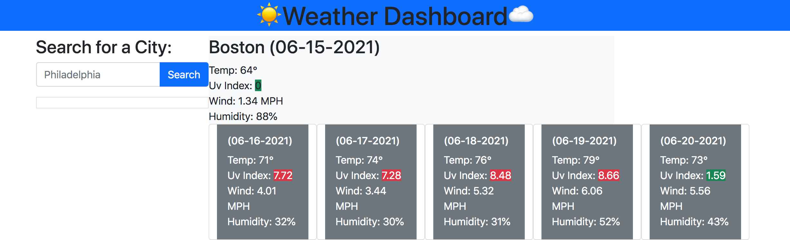

# Weather Checker

## Description
I assigned to create a weather checker using the OpenWeather API. I spent most of my time familiarizing myself with the docs for API set up, and how to get the extract the information I needed. While working on this project I gained experience and confidence in creating dynamically generated elements with JavaScript.  

## Table of Contents (Optional)
- [Installation](#installation)
- [Usage](#usage)
- [Credits](#credits)
- [Notes](#Notes)
- [License](#license)

## Installation
No installs required. Works best in an updated browser.

## Usage
https://keith-l-watford.github.io/weather-checker/
Expected behavior: A user would type in their city and recieve the weather results.

Actual behavior: Nothing happens, the input and 'search' button arent properly set up. As it stands currently, you have to change the city in the JS file to get a different city's weather results
UPDATE: June 17th, 2021 - Got the search feature to work.

Here's a screenshot of the reference website:

## Credits
Shout out to my tutor scott for helping me with the API set up and working with the docs.

## Notes
I will definitely be return to this project when I am able. All that was left was to figure out the button input and using local storage to turn previously searched cities into clickable buttons.

## License
This is free and unencumbered software released into the public domain.

Anyone is free to copy, modify, publish, use, compile, sell, or distribute this software, either in source code form or as a compiled binary, for any purpose, commercial or non-commercial, and by any means.

In jurisdictions that recognize copyright laws, the author or authors of this software dedicate any and all copyright interest in the software to the public domain. We make this dedication for the benefit of the public at large and to the detriment of our heirs and successors. We intend this dedication to be an overt act of relinquishment in perpetuity of all present and future rights to this software under copyright law.

THE SOFTWARE IS PROVIDED "AS IS", WITHOUT WARRANTY OF ANY KIND, EXPRESS OR IMPLIED, INCLUDING BUT NOT LIMITED TO THE WARRANTIES OF MERCHANTABILITY, FITNESS FOR A PARTICULAR PURPOSE AND NONINFRINGEMENT. IN NO EVENT SHALL THE AUTHORS BE LIABLE FOR ANY CLAIM, DAMAGES OR OTHER LIABILITY, WHETHER IN AN ACTION OF CONTRACT, TORT OR OTHERWISE, ARISING FROM, OUT OF OR IN CONNECTION WITH THE SOFTWARE OR THE USE OR OTHER DEALINGS IN THE SOFTWARE.

For more information, please refer to http://unlicense.org/